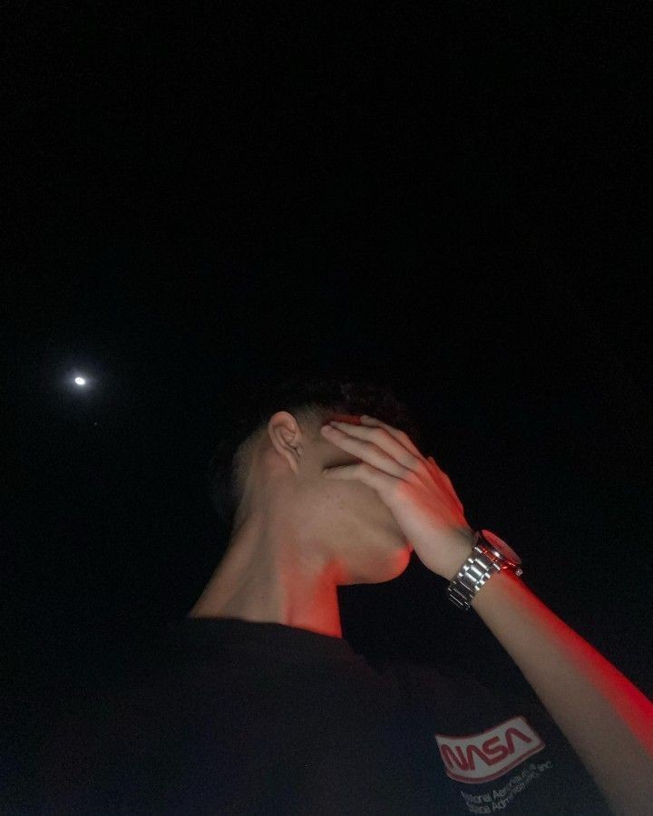

  

# Hi there! 👋 I'm Syntax!

Welcome to my GitHub profile! I'm a passionate developer, tech enthusiast, and lifelong learner dedicated to creating innovative and impactful solutions. Here, you’ll find a variety of projects that showcase my skills, interests, and creativity. Let's connect and build something amazing together!

---

## 🧑‍💻 About Me

- 🎓 **Education**: Currently am in school
- 🌍 **Location**: Telangana, Hyd
- 👨‍💻 **Currently Working On**: A Telegram Bot
- 📚 **Currently Learning**: Currently Am Learing TS
- 💬 **Ask Me About**: [Technologies/Fields You're Comfortable Discussing]
- ⚡ **Fun Fact**: [Something Interesting About You!]

---

## 🔧 Technologies & Tools

> *(Add or replace badges for the tools and languages you use)*

---

## 📈 GitHub Stats

---

## 🚀 My Projects

Here are a few projects that I’m most proud of:

- **[Project Name](https://github.com/yourusername/project-repo)**  
  _Brief description of the project, what it does, and the technologies used._

- **[Another Cool Project](https://github.com/yourusername/another-repo)**  
  _Another brief description._

- **[Awesome Bot Dashboard](https://github.com/yourusername/awesome-bot-dashboard)**  
  _A Discord bot dashboard for managing and monitoring bots._

> *(Add more projects or create a [Pinned Repositories](https://docs.github.com/en/account-and-profile/setting-up-and-managing-your-github-profile/pinning-repositories-to-your-profile) section in GitHub)*

---

## 💼 Connect with Me

- [LinkedIn](https://linkedin.com/in/yourlinkedin)  
- [Twitter](https://twitter.com/yourtwitter)  
- [Email](mailto:youremail@example.com)  

Let’s connect and talk about tech, projects, or just share some ideas! 😊

---

## 📅 Weekly Development Breakdown

<!--START_SECTION:waka-->
<!--END_SECTION:waka-->

*(This section updates automatically with your coding activity. To set it up, follow [WakaTime's instructions](https://wakatime.com/))* 

---

## 🌱 Recent Blog Posts

> *(If you have a blog, add recent articles here using GitHub's [Markdown Links](https://guides.github.com/features/mastering-markdown/) or a [RSS feed integration](https://github.com/gautamkrishnar/blog-post-workflow))*  
> 1. [Blog Post Title](https://yourblog.com/post1)  
> 2. [Another Blog Post](https://yourblog.com/post2)  
> 3. [More Blogging](https://yourblog.com/post3)  

---

## 🎉 Fun Facts About Me

- I love coffee, coding, and cats! 🐱☕
- I can solve a Rubik's cube in under a minute.
- Always down for a game of chess! ♟️

---

⭐️ _If you find my projects helpful or interesting, feel free to give them a star!_

Thanks for visiting my GitHub profile! 😊
